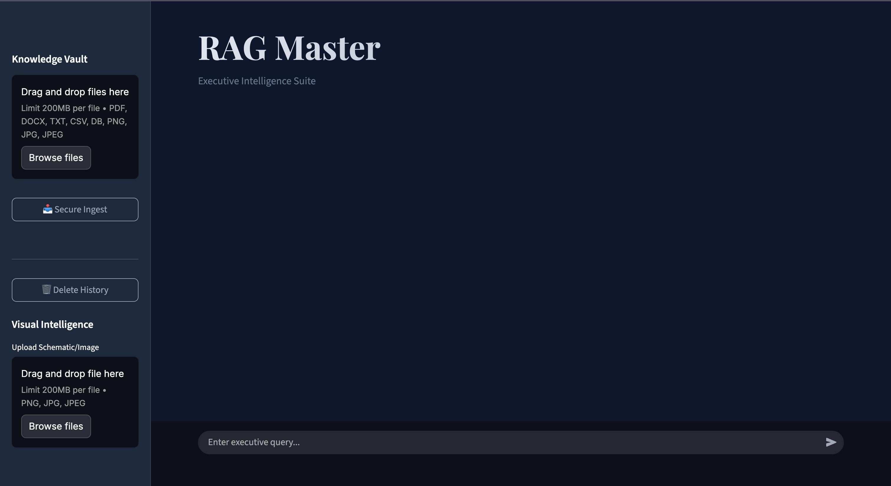
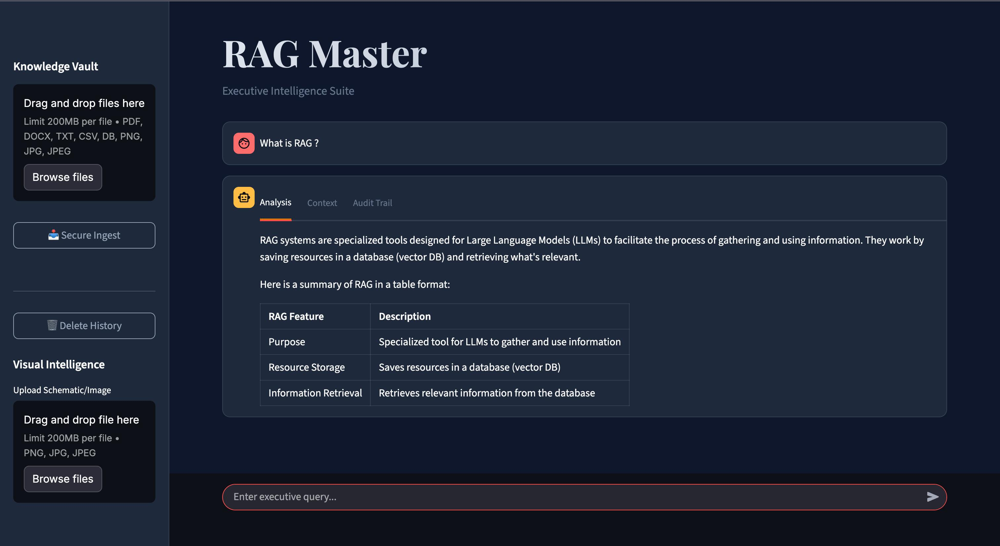
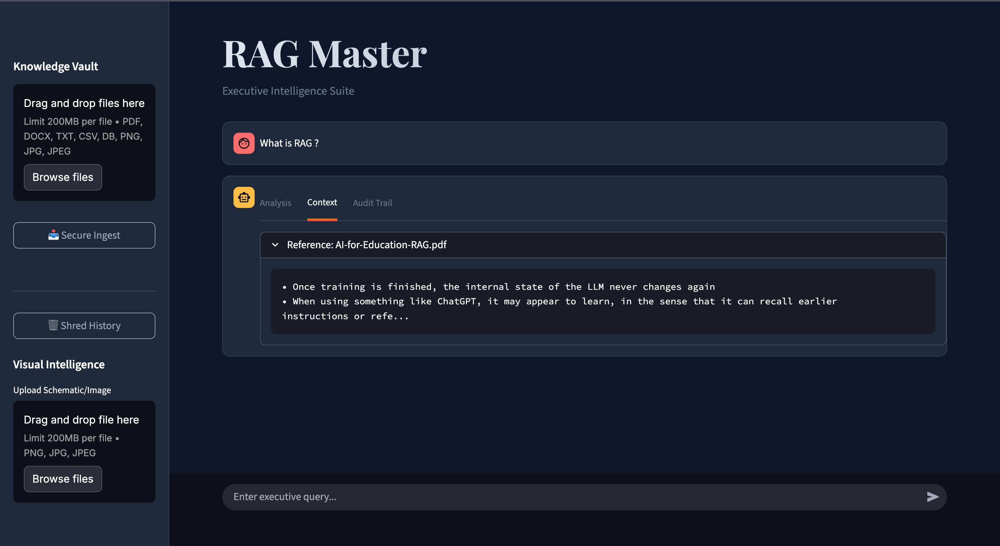

# 💎 RAG Master | Executive Intelligence Suite

A premium, localized Retrieval-Augmented Generation (RAG) system that allows you to chat with your documents and images. Built with **FastAPI**, **Streamlit**, **Groq (Llama 3)**, and **ChromaDB**.

  

## 📸 App Demo

*Main Interface exploring documents.*


*Smart search with Answer, Context, and Source tabs.*


*Visual intelligence analyzing a schematic.*


## ✨ Features

- **📄 Multi-Format Support**: Ingest PDF, DOCX, TXT, CSV, SQL, and Image files.
- **🧠 Local Embeddings**: Uses `HuggingFace (all-MiniLM-L6-v2)` for free, privacy-focused vector embeddings running on your CPU.
- **🚀 High-Speed Inference**: Powered by **Groq's LPU** (Language Processing Unit) using the `llama-3.3-70b-versatile` model.
- **👁️ Visual Intelligence**: text-enabled analysis of uploaded images/schematics (OCR & Vision).
- **💎 Elite UI**: A custom-styled "Executive Navy" Streamlit interface with tabs for Analysis, Context, and Sources.
- **🔐 Secure & Local**: Your documents are indexed locally in `storage/chroma_db`.

---

## 🛠️ Environment Setup

### Prerequisites
- Python 3.10+
- [Tesseract OCR](https://github.com/tesseract-ocr/tesseract) (for image text extraction)
  - **Mac**: `brew install tesseract`
  - **Windows**: [Installer](https://github.com/UB-Mannheim/tesseract/wiki)
  - **Linux**: `sudo apt-get install tesseract-ocr`

### Installation

1. **Clone the Repository**
   ```bash
   git clone https://github.com/Sabuj-Majumder/rag_chatbot.git
   cd rag_project
   ```

2. **Create a Virtual Environment**
   ```bash
   python -m venv venv
   source venv/bin/activate  # On Windows: venv\Scripts\activate
   ```

3. **Install Dependencies**
   ```bash
   pip install -r requirements.txt
   ```

---

## 🔑 Configuration

Create a `.env` file in the root directory:

```ini
# .env file

# Get a free API Key from https://console.groq.com/keys
GROQ_API_KEY=gsk_your_groq_api_key_here

# Optional: Disable tokenizer parallelism warnings
TOKENIZERS_PARALLELISM=false
```

---

## 🚀 Running the Application

### 1. Start the Backend API (FastAPI)
This handles document processing, vector storage, and the LLM logic.
```bash
uvicorn main:app --reload --port 8000
```
*API will run at `http://localhost:8000`*

### 2. Start the Frontend (Streamlit)
In a new terminal window, launch the user interface.
```bash
streamlit run streamlit_app.py
```
*App will open at `http://localhost:8501`*

---

## 📚 API Usage

The backend provides REST endpoints documented at `http://localhost:8000/docs`.

### Common Endpoints

| Method | Endpoint | Description |
| :--- | :--- | :--- |
| **POST** | `/upload` | Upload and index a file (PDF, CSV, Image, etc.). Returns a `file_id`. |
| **POST** | `/query` | Ask a question. Accepts JSON body with `question` and optional `image_base64`. |

**Example Query Payload:**
```json
{
  "question": "Summarize the financial report.",
  "image_base64": null
}
```

---

## 🏗️ Tech Stack

- **LLM**: Meta Llama 3 (via Groq Cloud)
- **Embeddings**: `sentence-transformers/all-MiniLM-L6-v2` (Local)
- **Vector DB**: ChromaDB (Persistent local storage)
- **OCR**: Pytesseract (Tesseract Wrappers)
- **Frameworks**: FastAPI (Backend), Streamlit (Frontend), LangChain (Orchestration)

---

## 📝 License
This project is open-source. Feel free to modify and distribute.
